# The Overnight Engine

Garden-viz doordrop, automated. You photograph front gardens and post
envelopes; everything in between runs itself on Claude Cowork routines while
you sleep.

## Honesty first (read once)

- **This is not fully passive.** The automated part: makeover generation,
  print-ready flyers, house codes, lead ledger, pitch pack, weekly stats.
  The part only you can do: a ~20-minute photo walk, a print shop visit,
  pushing envelopes through doors, and answering whoever responds.
- **Homeowner response rate: [Unverified].** That is the whole point of the
  20-house street test. No revenue claim exists until a stranger pays.
- **Legality:** postal doordrop marketing needs no prior consent (ICO
  guidance — verified in your earlier research). Cold email would not be
  legal; that route stays killed.
- **Licence:** everything under `engine/` and `campaigns/` is original work
  (MIT, yours). The upstream `skills/` pack is CC BY-NC 4.0, and its
  `COMMERCIAL-LICENSE.md` §1 explicitly permits using the skills to run
  your *own* business for your own income (attribution kept, no
  redistribution/resale of the pack). Reselling the pack itself stays
  forbidden.

## The loop

```mermaid
flowchart LR
    A[You: phone photos<br>of front gardens] -->|upload to intake/| B[Nightly routine<br>05:00 UTC]
    B --> C[AI makeover<br>MuAPI nano-banana-edit]
    C --> D[A5 flyer PDF<br>per house + batch PDF]
    D -->|committed to repo| E[You: print + doordrop]
    E --> F[Responses<br>QR / phone, house code]
    F -->|logged in leads.csv| G[Weekly digest routine<br>stats + pitch pack]
    G --> H[Sell leads / campaigns<br>to landscapers]
```



## One-time setup (the current brick)

1. **Image API key** — create a MuAPI account, add `MUAPIAPP_API_KEY` as an
   environment variable in this Cowork environment's settings. Without it
   the engine still runs but produces clearly-stamped mock makeovers.
2. **Contact details** — fill the `SET ME` fields in
   `campaigns/garden-doordrop/campaign.json` (phone; optionally a free
   Tally/Google form URL for the QR code).
3. **Costs** — when you know MuAPI's per-image price and the print shop's
   per-flyer price, fill `costs_gbp` so stats stay honest.

## Day to day

- **Add photos** (from your phone): open the repo on github.com → branch
  `claude/passive-income-framework-jtw4vc` → `campaigns/garden-doordrop/intake/`
  → "Add file → Upload files". JPG/PNG. One photo per house.
- **Overnight** the nightly routine processes them and commits flyer PDFs to
  `campaigns/garden-doordrop/out/flyers/` (one per house + a single
  `batch_<date>.pdf` for the print shop). You get a push notification with
  the summary.
- **Log reality** in `campaigns/garden-doordrop/leads.csv` — when you dropped
  a street, when someone responds (their house code tells you which garden).
  Edit the CSV on github.com from your phone, or just tell any Claude session.
- **Sunday evening** the digest routine reports flyers made, drops, response
  rate, and costs, and regenerates the landscaper pitch pack from real
  numbers only.

## Manual runs

```bash
pip install -r engine/requirements.txt
python3 engine/run.py --mock       # test without an API key
python3 engine/run.py              # real makeovers (needs MUAPIAPP_API_KEY)
python3 engine/run.py stats
python3 engine/run.py pitch
```

An example of the printed product: `engine/templates/example_flyer.pdf`
(mock makeover of a dummy photo — the pipeline's proof-of-plumbing run).

## Where the borrowed ideas came from

- `ai-real-estate-stager` (MIT): the MuAPI image-edit call pattern, verified
  from its working source.
- `show-me-the-money` skills: the weekly digest leans on `money-report`, the
  landscaper outreach on `money-outreach` (own-business use per its
  COMMERCIAL-LICENSE §1, attribution: https://github.com/iamzifei/show-me-the-money).
- `n8n`, SaaS templates: deliberately **not** used yet. Self-hosting an
  automation server or launching a SaaS adds ops burden before the street
  test has proven anyone responds. Parked, not forgotten — see `LEDGER.md`.

## Scaling later (only after the street test)

Same engine, different buyer: garden-centre upsell (`campaign.json` with a
plant-stock style prompt), landscaper white-label streets, e-commerce plant
photo enhancement. Each is a new folder under `campaigns/` — the code
doesn't change.
